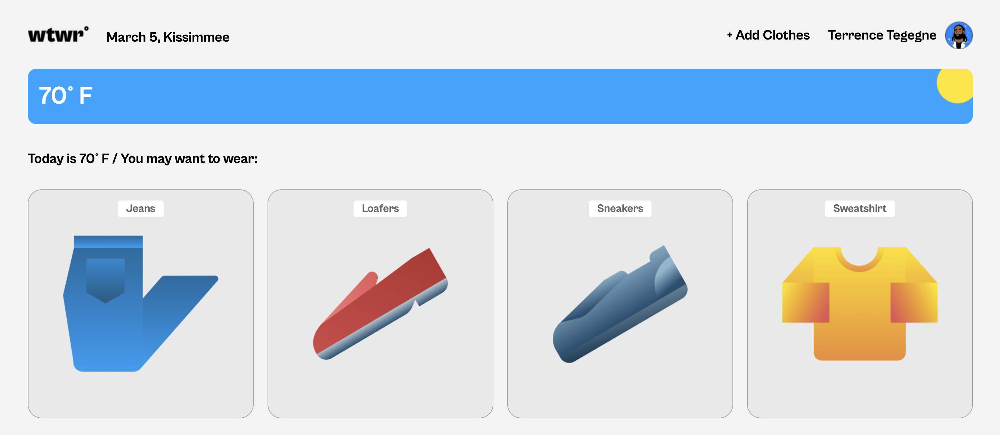

# WTWR: What to Wear

WTWR is a React.js application for deciding what to wear based on the weather. It uses the openweathermap.org API to get weather data. Currently it is hard coded to my location (Kissimme, FL) and has very basic clothing options.

## Technologies Used

- HTML5
- CSS3
- React.js
- Flexbox and grid layout
- Responsive design

## Project Preview

The project can be previewed on Github Pages, located at [https://joepotenza.github.io/se_project_react](https://joepotenza.github.io/se_project_react).

## Project Design

The project was designed by TripleTen using Figma. [The detailed design can be found here](https://www.figma.com/design/F03bTb81Pw8IDPj5Y9rc5i/Sprint-10-Project--WTWR?node-id=209-98&t=LqNtASN10P9D6Wh4-0).

## Future Improvements

Planned additions to the project include:

1. Form processing
2. Persistent data storage
3. Ability to select location

