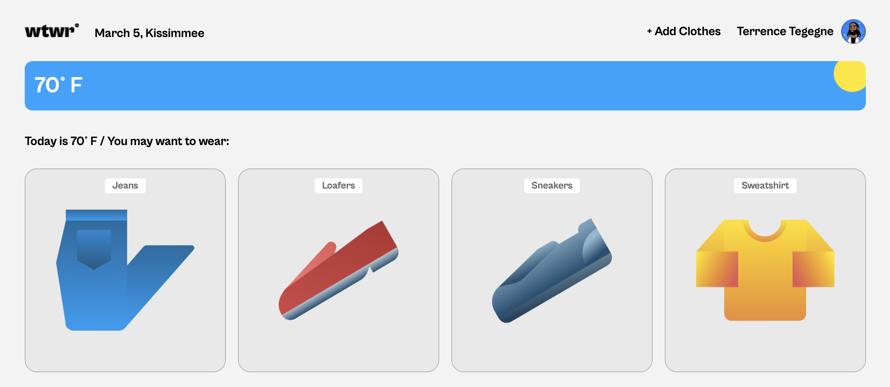

# WTWR: What to Wear

WTWR is a React.js application for deciding what to wear based on the weather. It uses the openweathermap.org API to get weather data. Currently it is hard coded to my location (Kissimmee, FL) and has very basic clothing options.

## Technologies Used

- HTML5
- CSS3
- React.js
- Flexbox and grid layout
- Responsive design

## Back-End

The Back-End code can be found at [https://github.com/joepotenza/se_project_express](https://github.com/joepotenza/se_project_express).

## Project Preview

The project can be previewed on Github Pages, located at [https://joepotenza.github.io/se_project_react](https://joepotenza.github.io/se_project_react). **Currently this shows a previous version of the application** due to the implementation of a "dummy" JSON backend. This will be fixed in the next update when the site is moved to Google Code.

- [Initial Walkthrough](https://drive.google.com/file/d/1oSUFu6JB8UHMvwzv5auHKdtWAUS_YcnK/view?usp=sharing)

## Project Design

The project was designed by TripleTen using Figma. [The detailed design can be found here](https://www.figma.com/design/bfVOvqlLmoKZ5lpro8WWBe/Sprint-14_-WTWR?node-id=0-1&p=f&t=ZCjTdghyjJbRmiJT-0).

## Future Improvements

Planned additions to the project include:

1. Form processing
2. Persistent data storage
3. Ability to select location

