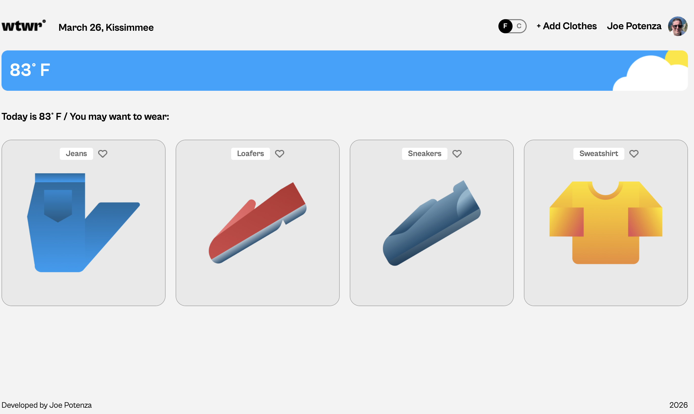
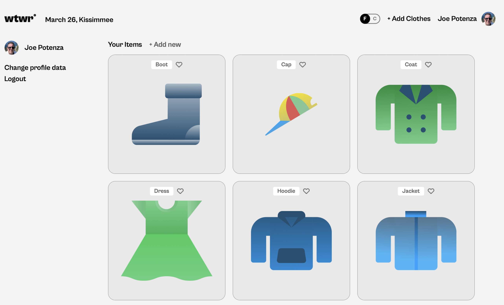
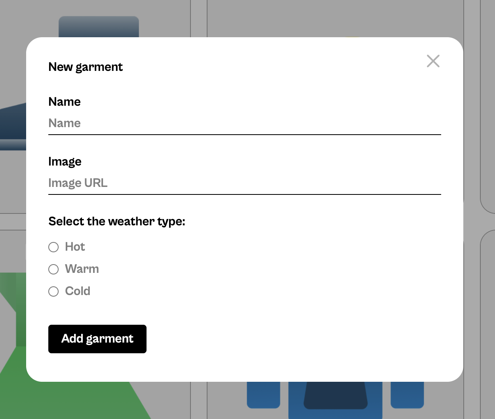

# WTWR: What to Wear

WTWR is a React.js application for deciding what to wear based on the weather. It uses the openweathermap.org API to get weather data. It allows for user registration, and utilizes the browser's geolocation data to determine the user's location for weather reports.

## Technologies Used

- HTML5
- CSS3
- React.js
- Vite
- Geolocation support
- Flexbox and grid layout
- Responsive design

## Back-End

The Back-End API code, written in Node.js and Express, can be found at [https://github.com/joepotenza/se_project_express](https://github.com/joepotenza/se_project_express)

## Project Preview

The project can be previewed at [https://wtwr.bigjoepo.com/](https://wtwr.bigjoepo.com/)

The video below is from an earlier release but shows the basic functionality:

- [Initial Walkthrough video](https://drive.google.com/file/d/1oSUFu6JB8UHMvwzv5auHKdtWAUS_YcnK/view?usp=sharing)

## Project Design

The project was designed by TripleTen using Figma. [The detailed design can be found here](https://www.figma.com/design/bfVOvqlLmoKZ5lpro8WWBe/Sprint-14_-WTWR?node-id=0-1&p=f&t=ZCjTdghyjJbRmiJT-0).

### Homepage Screenshot

### Profile Page Screenshot

### "New Garment" Modal Screenshot

